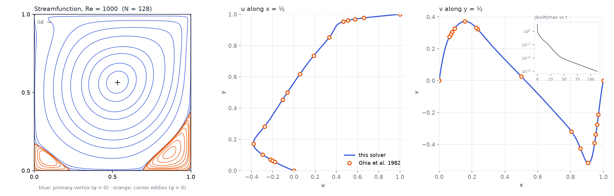
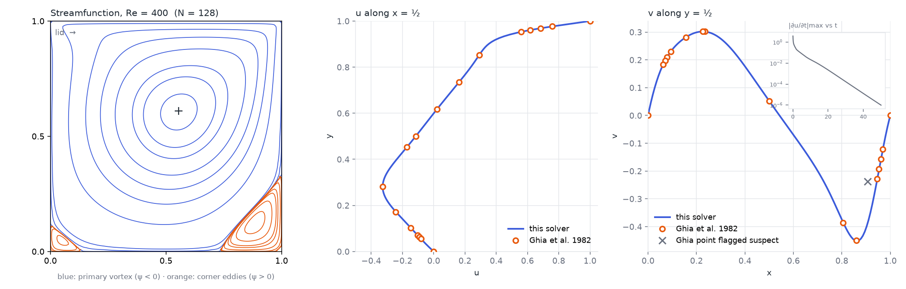
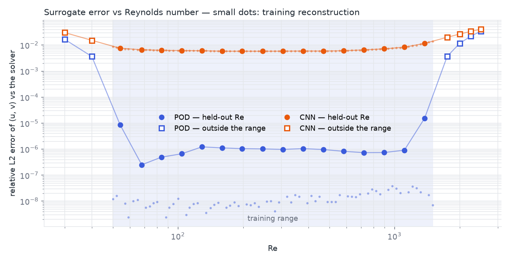
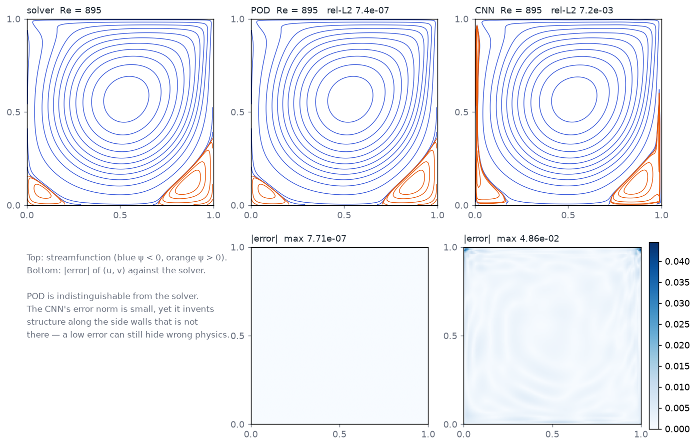

# cavity-surrogate

A validated 2D Navier–Stokes solver for the lid-driven cavity, and a neural surrogate trained on it.

The lid-driven cavity is the canonical benchmark for incompressible flow solvers: a square box of fluid,
three fixed walls, a top wall sliding at constant speed. One parameter — the Reynolds number — and a
published reference solution (Ghia, Ghia & Shin, 1982) that every CFD code is checked against.

This repo does two things, in order:

1. **Solver** — writes the incompressible Navier–Stokes equations down, discretises them (Chorin
   projection on a staggered grid, pure numpy) and proves the implementation right against analytic
   limits and the Ghia reference data.
2. **Surrogate** — trains a small model on many solver runs so that, for a new Reynolds number, the
   whole flow field is predicted in milliseconds instead of minutes — with its error against the real
   solver measured and shown, inside and outside the training range.

The method is the point: derive → verify → build. Nothing here is trusted because it looks right.

## Verification ladder

Solver — all on `main`, reproducible with the commands in `verify/`
- [x] Discrete divergence of the corrected velocity field ≈ machine zero every step — **1e-13 to 1e-14**
- [x] Converges to steady state (residual history) at Re = 100, 400, 1000
- [x] Grid convergence 16² → 32² → 64² → 128² at the expected order — **observed order 1.9–2.3** (second-order scheme)
- [x] Centreline profiles match Ghia et al. (1982) at Re = 100, 400, 1000 — **max deviation 0.5% / 0.5% / 1.2% of lid speed**
- [x] Primary vortex centre matches published location — **exact to the grid at Re = 100 and 1000**

Surrogate — two models, same evaluation
- [x] Held-out Re: relative L2 error of the predicted field vs the solver — **POD 2.3e-6 mean · CNN 6.8e-3 mean**
- [x] Predicted field respects ∇·u ≈ 0 (a constraint the model was never told) — **POD equals the solver's own residual; CNN 4× worse**
- [x] Error vs Re, with the training range marked — honest inside, degrading outside — **both degrade immediately past the edges**

## Solver results



| Re | grid | max ∣∇·u∣ | max ∣Δu∣ | max ∣Δv∣ | vortex centre (solver / Ghia) | ψ_min (solver / Ghia) |
|---:|---:|---:|---:|---:|---|---|
| 100 | 128² | 3e-13 | 0.0049 | 0.0091 | (0.6172, 0.7344) / (0.6172, 0.7344) | −0.10344 / −0.10342 |
| 400 | 128² | 5e-14 | 0.0020 | 0.0051 † | (0.5547, 0.6094) / (0.5547, 0.6055) | −0.11349 / −0.11391 |
| 1000 | 128² | 2e-14 | 0.0030 | 0.0124 | (0.5312, 0.5625) / (0.5313, 0.5625) | −0.11751 / −0.11793 |

Deviations are against the 17 + 17 tabulated centreline points, as a fraction of the lid speed.

Two things the checks turned up that a "looks right" pass would have missed:

- **The deviation from Ghia plateaus as the grid refines** (Re = 100: 0.38% at 64², 0.49% at 128²) while the
  solver's own grid-to-grid change keeps shrinking 4× per halving of h. The residual gap is therefore the 1982
  reference's own discretisation error, not this solver's — consistent with later spectral results (Botella &
  Peyret 1998) that differ from Ghia by a similar amount.
- **† One printed reference value is wrong.** Ghia's Table II, Re = 400, v at x = 0.9063 = −0.23827 is
  non-monotone against its own neighbours (−0.228 at 0.9453, −0.450 at 0.8594) and 15% off a solver that matches
  the other 16 points to 0.2%. It is reproduced identically in every copy of the table found, so it is in the
  paper. It stays verbatim in `verify/ghia.py`, flagged `SUSPECT`, drawn as a grey × in the figures and excluded
  from the verdict line — never silently corrected.



## Surrogate results

**Dataset.** 86 solver runs on 128², Re log-spaced in [50, 1500] (80 values; every 5th — 16 — held out and never
trained on) plus 6 cases outside the range (30, 40, 1750, 2000, 2250, 2500) to measure how the surrogates degrade
where they have no right to be good. Every run converged to |∂u/∂t| < 1e-6 with ∇·u ≈ 1e-13 and a flat grid-scale
oscillation metric (0.040–0.050), i.e. the grid resolved every case. 243 worker-minutes, 68 min wall on four cores.

**Two surrogates, one evaluation.**

- **POD + spline** — proper orthogonal decomposition of the 64 training fields (15–20 modes) and a natural cubic
  spline through the mode coefficients in log Re. Linear subspace, deterministic, no training loop. ~20 numbers per Re.
- **CNN decoder** — log Re → dense → 4×4 → five upsampling stages → the (2, 128, 128) field. 500k parameters, MSE,
  Adam, 4000 full-batch epochs, 6 min on an RTX 2060.



| | held-out Re, inside [50, 1500] | outside the range | divergence of the prediction (RMS, solver's own: 8e-3) |
|---|---|---|---|
| **POD** | rel-L2 **2.3e-6** mean, 1.5e-5 max | 0.4% at Re 1750 → 3.4% at Re 2500 | 8.4e-3 — identical to the solver |
| **CNN** | rel-L2 **6.8e-3** mean, 1.2e-2 max | 2.0% at Re 1750 → 4.1% at Re 2500 | 3.1e-2 inside, 7e-2 outside |



What the checks say, in order of importance:

- **The linear model is essentially exact and the neural one is not — by three orders of magnitude.** A steady
  flow that depends on one parameter traces a smooth curve through field space; 15 POD modes and a spline follow
  that curve to 2e-6, which is the solver's own convergence floor. The CNN, with 25,000× more parameters, reaches
  0.7% and *invents structure along the side walls* that the solver does not have (bottom row of the figure). A small
  error norm can still hide wrong physics — which is why the field comparison sits next to the number.
- **Incompressibility is a free consequence of POD and a partly-learned one for the CNN.** A linear combination of
  divergence-free fields is divergence-free, so POD's predictions carry exactly the solver's residual (8.4e-3, the
  centred-difference baseline). The CNN was never told ∇·u = 0 and only half learned it: 4× the baseline inside the
  range, 10× outside.
- **Both degrade the moment they leave the training range**, and the plot says so rather than hiding it. POD goes
  from 1e-6 to 1e-2 within one step past either edge. A surrogate is an interpolation of a validated solver — not a
  replacement for physics, and never an extrapolation.

The interactive demo therefore runs on the POD model. The CNN stays in the repo as the comparison that earned that
decision.

## The demo — `web/`

A single static page: a Re slider on a log scale with the training range shaded, the predicted field drawn live
(speed in colour, streamfunction as lines, ~1 ms per prediction — mean + 20 modes, evaluated in the browser), and a
"check against the solver" card that always shows the nearest Re the model never trained on, the solver's field next
to the surrogate's, the relative-L2 error, and the error-vs-Re curve. Push the slider past 1500 and watch the error
climb — that is the point.

```
.venv\Scripts\python surrogate\export_web.py         # writes web/model/ (2.7 MB modes + 22 verification runs)
py -3.12 -m http.server 8792 --directory web         # then open http://localhost:8792
```

## Layout

```
solver.py      the Navier–Stokes solver (numpy)
verify/        the checks above, each a script that prints its numbers
  ghia.py               the 1982 reference tables, verbatim, with the suspect point flagged
  compare_ghia.py       run + overlay + verdict + figure        --re 100|400|1000 --n 128
  grid_convergence.py   observed order of accuracy               --re 100 --grids 16 32 64 128
figures/       the committed figures the README shows
data/          solver runs used to train the surrogate (generated, not committed)
surrogate/
  generate.py           the dataset: 86 runs, 4 worker chains with continuation in Re
  data.py               loader + metrics (relative L2, RMS centred divergence, vortex centre)
  pod.py                POD + natural cubic spline in log Re          → models/pod.npz
  cnn.py                the convolutional decoder (torch, GPU)        → models/cnn.pt
  evaluate.py           held-out / outside-range tables + the two figures above
  models/               the two fitted surrogates (committed, 7 MB)
web/           the interactive Re-slider demo (static; model/ is generated by surrogate/export_web.py)
```

## Running

```
py -3.12 -m venv .venv
.venv\Scripts\pip install -r requirements.txt
.venv\Scripts\python solver.py --re 100 --n 64
.venv\Scripts\python verify\compare_ghia.py --re 1000 --n 128       # ~5 min
.venv\Scripts\python verify\grid_convergence.py --re 100
.venv\Scripts\python surrogate\generate.py --workers 4               # ~70 min, writes data/
.venv\Scripts\python surrogate\pod.py
.venv\Scripts\python surrogate\cnn.py                                # GPU, ~6 min
.venv\Scripts\python surrogate\evaluate.py
```

## Reference

Ghia, U., Ghia, K. N., & Shin, C. T. (1982). High-Re solutions for incompressible flow using the
Navier–Stokes equations and a multigrid method. *Journal of Computational Physics*, 48(3), 387–411.
